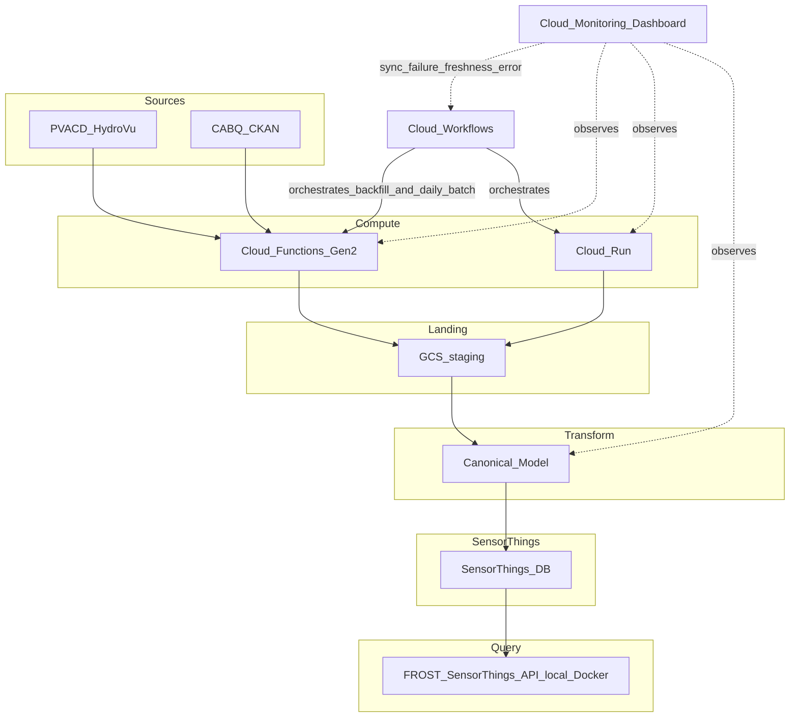

# Aqueduct POC A (`aqueduct-poc-alpha`)

Scratch repo for a GCP-native proof of concept that ingests **PVACD HydroVu** and **City of Albuquerque (CABQ) CKAN** data, lands it in **GCS** in a staging form, transforms via a **canonical model agreement** into **SensorThings**, and exposes data through a **local FROST** instance spun up via docker compose.

## Why this repo exists

- Validate a **GCP-native pattern** at this scale with **minimal dependencies** and an **accessible operating model**.
- Built **from scratch** in this repo; existing pipeline code may be reused to help with patterns and snippets and drive faster development.
- Owned by **ICASA**, with **Data Services** cross-engineering support on **source 2 (CABQ)**.
- Stack: **Cloud Workflows**, **Cloud Functions Gen 2**, and **Cloud Run** — no deprecated frameworks or packages, with **Cloud Workflows** and **Cloud Monitoring** sitting above the pipeline.

## Acceptance criteria

- [ ] **Sources:** PVACD HydroVu; CABQ CKAN
- [ ] **History:** 1 month of historical data per source
- [ ] **Loads (HydroVu):** Backfill
- [ ] **Loads (CABQ):** Backfill
- [ ] **Increment (HydroVu):** Incremental daily batch
- [ ] **Increment (CABQ):** Incremental daily batch
- [ ] **Soak:** "Daily" batch loads succeed for at least 2 consecutive increments
- [ ] **Staging:** Data lands in **GCS** (e.g. `raw/{source}/dt=YYYY-MM-DD/`)
- [ ] **Transform (HydroVu):** Canonical model contract → **SensorThings DB**
- [ ] **Transform (CABQ):** Canonical model contract → **SensorThings DB**
- [ ] **Query:** Data queryable via **FROST SensorThings API** from local FROST instance
- [ ] **Local FROST:** Docker instance using the latest [FROST-Server](https://hub.docker.com/r/fraunhoferiosb/frost-server/)
- [ ] **Ops:** **Cloud Monitoring** dashboard example with example alerts for sync failure, freshness, and error
- [ ] **Docs:** Evaluation writeup scoring the POC against criteria (separate deliverable)
- [ ] **Code:** All pipeline code lives in this repo

## Architecture



**Cloud Workflows** schedules and coordinates backfill and incremental daily batch runs across Gen 2 functions and Cloud Run jobs.

**Cloud Monitoring** (dashboard exapmle for sync failure, freshness, and error) sits above the pipeline and observes Workflows and downstream steps — not in the critical data path.

**Backfill vs incremental:** Daily batches use idempotent writes keyed by source and observation time. Backfill replays a configurable window (initially one month).

## Suggested layout (starting point, this may not be the ideal structure)

Starting-point, please change as needed.

```
aqueduct-poc-alpha/
├── README.md
├── pyproject.toml
├── src/                      # shared libs: clients, models, transforms
├── functions/                # Gen 2 entrypoints per source or per stage
├── run/                      # Cloud Run related if needed
├── workflows/                # Cloud Workflows if needed
└── Dockerfile                # Dockerfile if needed
└── docker-compose.yml        # Docker compose for local FROST and backing Postgres
```

## Technology and non-goals

**In scope:** Python 3.13, `uv` for package management, GCS staging, Cloud Workflows, Cloud Functions Gen 2, Cloud Run, Pydantic for the canonical contract, local FROST via Docker.

**Python practices for our team:** Can be found at [Data Integration Group Python best practices](https://github.com/DataIntegrationGroup/.github/blob/main/profile/README.md) — use as a reference, don't worry about compliance for this POC.

## Prerequisites

To be filled in as the POC is implemented:

- `uv` and Python 3.13
- `gcloud` CLI, authenticated to the target GCP project
- Docker for local FROST and backing Postgres
- `.env.example` → `.env` (when added); secrets in cloud via Secret Manager


