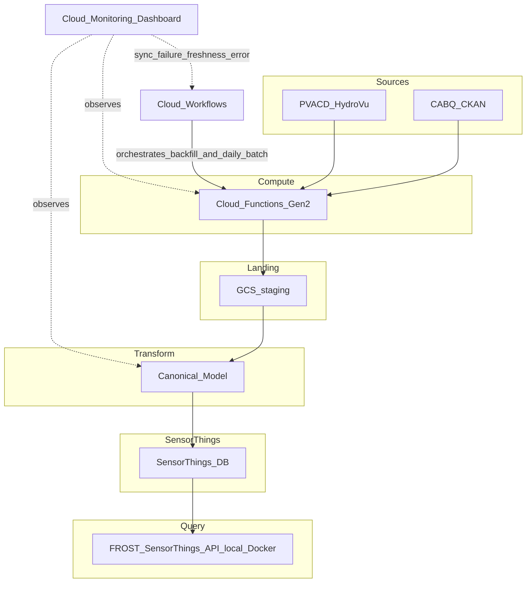

# Aqueduct POC A (`aqueduct-poc-alpha`)

Scratch repo for a GCP-native proof of concept that ingests **PVACD HydroVu** and **City of Albuquerque (CABQ) CKAN** data, lands it in **GCS** in a staging form, transforms via a **canonical model agreement** into **SensorThings**, and exposes data through a **local FROST** instance spun up via docker compose.

## Why this repo exists

- Validate a **GCP-native pattern** at this scale with **minimal dependencies** and an **accessible operating model**.
- Built **from scratch** in this repo; existing pipeline code may be reused to help with patterns and snippets and drive faster development.
- Owned by **ICASA**, with **Data Services** cross-engineering support on **source 2 (CABQ)**.
- Stack: **Cloud Workflows** and **Cloud Functions Gen 2** — no deprecated frameworks or packages, with **Cloud Workflows** and **Cloud Monitoring** sitting above the pipeline.

## Acceptance criteria

- **Sources:** PVACD HydroVu; CABQ CKAN
- **History:** 1 month of historical data per source
- **Loads (HydroVu):** Backfill
- **Loads (CABQ):** Backfill
- **Increment (HydroVu):** Incremental daily batch
- **Increment (CABQ):** Incremental daily batch
- **Soak:** "Daily" batch loads succeed for at least 2 consecutive increments
- **Staging:** Data lands in **GCS** (e.g. `raw/{source}/dt=YYYY-MM-DD/`)
- **Transform (HydroVu):** Canonical model contract → **SensorThings DB**
- **Transform (CABQ):** Canonical model contract → **SensorThings DB**
- **Query:** Data queryable via **FROST SensorThings API** from local FROST instance
- **Local FROST:** Docker instance using the latest [FROST-Server](https://hub.docker.com/r/fraunhoferiosb/frost-server/)
- **Ops:** **Cloud Monitoring** dashboard example with example alerts for sync failure, freshness, and error
- **Docs:** Evaluation writeup scoring the POC against criteria (separate deliverable)
- **Code:** All pipeline code lives in this repo

## Architecture (starting point, this may not be the ideal structure)




**Cloud Workflows** schedules and coordinates backfill and incremental daily batch runs across Gen 2 functions.

**Cloud Monitoring** (dashboard example for sync failure, freshness, and error) sits above the pipeline and observes Workflows and downstream steps — not in the critical data path.

**Backfill vs incremental:** Daily batches use idempotent writes keyed by source and observation time. Backfill replays a configurable window (initially one month).

## Repo layout

Flat bundle — package sits next to `main.py` so CF Gen 2 deploys resolve imports with no wheel or editable install. Mirror bravo at the **code contract** level (canonical model, adapters), not the src-layout packaging.

```
aqueduct-poc-alpha/
├── pyproject.toml                  # deps (uv source of truth)
├── requirements.txt                # generated for deploy: uv export --no-dev --no-emit-project
├── main.py                         # CF handlers — ingest + transform per source
├── docker-compose.yml              # local FROST + PostGIS
├── aqueduct_cloud_functions/       # shared package (mirrors bravo's aqueduct_dagster/)
│   ├── canonical/                  # SensorThings dataclasses, constants, BaseAdapter
│   ├── adapters/                   # source → canonical mapping (CABQ, HydroVu)
│   ├── clients/                    # TODO — GCS, HydroVu API, CKAN API
│   └── loaders/                    # TODO — canonical → FROST API
└── workflows/                      # TODO — orchestration YAML (backfill, daily batch)
```

- **Local dev:** `uv sync` for deps; run from repo root — `from aqueduct_cloud_functions.adapters import ...` just works
- **Deploy:** one bundle (`--source=.`), different `--entry-point` per function; see [Deploy](#deploy)

## Canonical model

The canonical model is the fixed SensorThings shape all source adapters must produce before data reaches FROST. It lives in [`aqueduct_cloud_functions/canonical/`](aqueduct_cloud_functions/canonical/) and mirrors the contract used in [aqueduct-poc-bravo](https://github.com/DataIntegrationGroup/aqueduct-poc-bravo/tree/scaffold-dagster-dlt/ST2DAT-78/src/aqueduct_dagster/canonical).


| File                     | Purpose                                                                                    |
| ------------------------ | ------------------------------------------------------------------------------------------ |
| `canonical_model.py`     | Dataclasses for Location, Thing, Sensor, ObservedProperty, Datastream, Observation, Bundle |
| `canonical_constants.py` | Shared units, sensors, observed properties, and key-building helpers                       |
| `base_adapter.py`        | Abstract adapter interface (`extract`, `to_thing`, `to_observations`, `run`)               |
| `CANONICAL_MODEL.md`     | Full entity reference and adapter conventions                                              |


Import from the package (repo root on `PYTHONPATH`):

```python
from aqueduct_cloud_functions.canonical import (
    BaseAdapter,
    CanonicalBundle,
    MANUAL_SENSOR,
    make_location_key,
)
```

Source adapters inherit `BaseAdapter` and yield `CanonicalBundle` objects. A FROST loader consumes those bundles — same contract as bravo, different orchestration layer.

## Source adapters

Mapping-only adapters in [`aqueduct_cloud_functions/adapters/`](aqueduct_cloud_functions/adapters/), mirroring [bravo's adapters](https://github.com/DataIntegrationGroup/aqueduct-poc-bravo/tree/scaffold-dagster-dlt/ST2DAT-78/src/aqueduct_dagster/adapters). Each adapter reads staged GCS data and maps it to the canonical model; ingest/auth stays in the Cloud Function handlers in `main.py`.


| Adapter          | Agency | Source                   |
| ---------------- | ------ | ------------------------ |
| `HydroVuAdapter` | PVACD  | PVACD HydroVu            |
| `CabqAdapter`    | CABQ   | City of Albuquerque CKAN |


```python
from aqueduct_cloud_functions.adapters import HydroVuAdapter, CabqAdapter

for bundle in HydroVuAdapter().run():
    ...  # pass to FROST loader
```

Implementation is stubbed with TODOs — same starting point as bravo.

## Technology

**In scope:** Python 3.13, `uv` for package management, GCS staging, Cloud Workflows, Cloud Functions Gen 2, dataclass-based canonical model (`aqueduct_cloud_functions.canonical`), Pydantic for typed config, local FROST via Docker.

**Python practices for our team:** Can be found at [Data Integration Group Python best practices](https://github.com/DataIntegrationGroup/.github/blob/main/profile/README.md) — use as a reference, don't worry about compliance for this POC.

## Python packages

Declared in [pyproject.toml](pyproject.toml). Install with `uv sync`. Regenerate [requirements.txt](requirements.txt) after dependency changes:

```bash
uv export --no-dev --no-emit-project -o requirements.txt
```

Add new packages with `uv add <package>`, then re-export.

**Runtime**

- `functions-framework` — HTTP/event entrypoints for Cloud Functions Gen 2
- `httpx` — HTTP client for API calls
- `pydantic` / `pydantic-settings` — typed config and settings
- `google-cloud-storage` — read and write GCS staging objects
- `google-cloud-secret-manager` — load secrets from GCP Secret Manager
- `geojson`, `shapely`, `pyproj`, `numpy` — parse and transform geospatial / temporal data (geometries, CRS, coordinates) for the canonical model as needed.

**Dev** (`uv sync --group dev`)

- `pytest` — unit and integration tests
- `pytest-cov` — test coverage reports
- `pytest-httpx` — mock HTTP responses in tests

## Deploy

One source bundle, multiple entry points. Handlers live in [`main.py`](main.py) — repeat deploy with a different `--entry-point` per function (`cabq_ingest`, `pvacd_to_frost`, etc.).

```bash
gcloud functions deploy pvacd_ingest \
  --gen2 --source=. --entry-point=pvacd_ingest \
  --runtime=python313 --trigger-http ...
```

## Prerequisites

- `uv` and Python 3.13
- `gcloud` CLI, authenticated to the target GCP project
- Docker and Docker Compose for local FROST and PostGIS
- `.env.example` → `.env` for compose (see [Local FROST](#local-frost)); secrets in cloud via Secret Manager

## Local FROST

Local [FROST-Server](https://hub.docker.com/r/fraunhoferiosb/frost-server/) (`2.6`) with PostGIS 16, via [docker-compose.yml](docker-compose.yml). Pattern follows the [official Docker deployment](https://fraunhoferiosb.github.io/FROST-Server/deployment/docker.html).

**Setup**

```bash
cp .env.example .env
# Edit .env: set POSTGRES_PASSWORD (and other vars if needed)
docker compose up -d
```

**Verify**

- Service root: [http://localhost:8080/FROST-Server/](http://localhost:8080/FROST-Server/)
- SensorThings API v1.1: [http://localhost:8080/FROST-Server/v1.1](http://localhost:8080/FROST-Server/v1.1)

Optional smoke test (demo entities from [Docker quick-start](https://fraunhoferiosb.github.io/FROST-Server/deployment/docker.html)):

```bash
curl -sO https://gist.githubusercontent.com/hylkevds/4ffba774fe0128305047b7bcbcd2672e/raw/demoEntities.json
curl -X POST -H "Content-Type: application/json" -d @demoEntities.json \
  http://localhost:8080/FROST-Server/v1.1/Things
```

**Reset data** (drops the `postgis_volume` volume):

```bash
docker compose down -v
```

**Pipeline integration:** write and query through the SensorThings HTTP API on FROST (e.g. `http://localhost:8080/FROST-Server/v1.1/...` with `httpx`). 
Running locally like this will probably not work for trying the functions when they are running in GCP, we can try to host a sample version of FROST-Server in GCP for this POC when we get to that task.